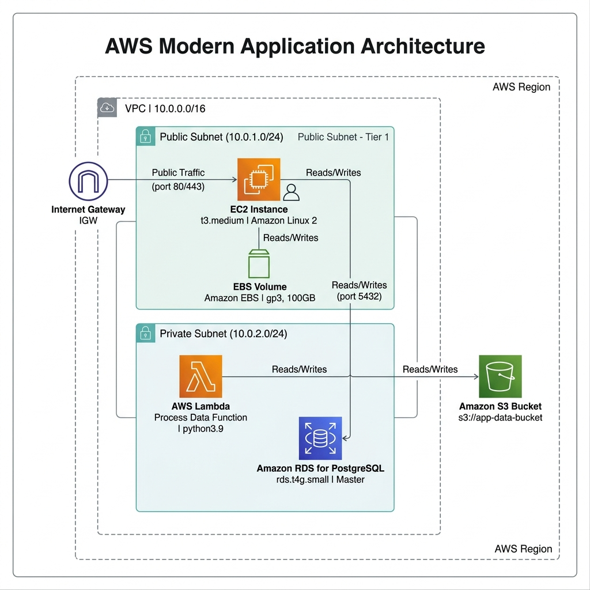

# Gerenciamento de Instâncias EC2 e Arquitetura de Fluxos na AWS

[](https://aws.amazon.com/)
[](https://www.terraform.io/)
[](https://app.diagrams.net/)

Este repositório contém o projeto de gerenciamento de instâncias Amazon EC2, volumes EBS e integração de serviços AWS, desenvolvido como parte de um desafio prático para a **DIO (Digital Innovation One)**. O repositório contém a documentação das atividades, o diagrama arquitetural feito no Draw.io e scripts de infraestrutura como código (IaC).

---

## 🎯 Objetivo do Laboratório

O principal objetivo deste laboratório é aplicar na prática os conceitos fundamentais de administração e provisionamento de infraestrutura em nuvem na AWS, focando em:
* Criação, configuração e controle do ciclo de vida de servidores virtuais (Amazon EC2).
* Armazenamento persistente em bloco (Amazon EBS) e estratégias de backup resilientes com Snapshots.
* Modelagem visual de arquiteturas integrando serviços de computação, banco de dados, serverless e armazenamento de objetos.

---

## 🗺️ Captura do Diagrama Gerado (Arquitetura)

O fluxo de arquitetura projetado representa uma aplicação web hospedada na AWS que interage com bancos de dados relacionais e grava logs/dados de forma assíncrona usando uma pipeline serverless:



> [!TIP]
> O arquivo editável deste diagrama está localizado em [`diagrams/arquitetura.drawio`](./diagrams/arquitetura.drawio). Para aprender a exportar e atualizar esta imagem, veja a seção [Exportando o Diagrama](#-como-exportar-o-diagrama).

---

## 🗂️ Estrutura do Projeto

O repositório está organizado de acordo com as melhores práticas de organização de projetos:

```text
aws-drawio-flow/
│
├── diagrams/
│   └── arquitetura.drawio     # Arquivo fonte do diagrama editável no Draw.io
│
├── images/
│   └── arquitetura.png        # Exportação visual do diagrama de arquitetura
│
├── docs/
│   └── observacoes.md         # Anotações detalhadas sobre EC2, EBS e Snapshots
│
├── terraform/                 # Opcional: Scripts de Infraestrutura como Código (IaC)
│   ├── main.tf
│   ├── variables.tf
│   └── outputs.tf
│
└── README.md                  # Documentação principal do projeto
```

---

## 🛠️ Serviços AWS Utilizados

* **Amazon EC2 (Elastic Compute Cloud):** Servidor virtual para hospedagem da aplicação.
* **Amazon EBS (Elastic Block Store):** Armazenamento em bloco de alta performance anexado ao EC2.
* **Amazon RDS (Relational Database Service):** Banco de dados relacional (PostgreSQL) para armazenamento persistente e estruturado.
* **AWS Lambda:** Execução de processamentos serverless acionados pela aplicação.
* **Amazon S3 (Simple Storage Service):** Armazenamento de arquivos e logs gerados pelo processamento do Lambda.
* **AWS IAM (Identity and Access Management):** Regras de acesso seguro entre os serviços usando o princípio do menor privilégio.

---

## 🚀 Passo a Passo Executado

1. **Provisionamento do Servidor:** Inicialização de uma instância EC2 usando a AMI Linux 2.
2. **Configuração de Segurança:** Configuração do Security Group da EC2 permitindo entradas apenas nas portas necessárias (`80`, `443` e `22`).
3. **Gerenciamento de Disco:** Criação de um volume adicional EBS e anexação ao servidor EC2.
4. **Resiliência e Backup:** Realização manual e automatizada de Snapshots do volume EBS para armazenamento seguro no S3.
5. **Simulação de Ciclo de Vida:** Testes de parada (Stop), inicialização (Start) e término (Terminate) para entendimento do comportamento de persistência de dados.
6. **Modelagem no Draw.io:** Desenho e refinamento do fluxo completo de rede e integração (VPC, Subnets, EC2, RDS, Lambda, S3).

---

## 💡 Aprendizados Obtidos

* **Persistência vs Efemeridade:** Diferença crucial entre armazenamento root e volumes adicionais EBS durante o término de instâncias.
* **Vantagens de Snapshots Incrementais:** Economia de espaço e custo ao realizar backups em bloco.
* **Segurança de Rede:** Importância do uso de sub-redes privadas para expor o banco de dados (RDS) apenas ao servidor de aplicação (EC2).
* **IaC:** Utilização de ferramentas como Terraform para traduzir a arquitetura visual do Draw.io diretamente em código reprodutível.

---

## 🏁 Conclusão

A prática consolidou a importância de planejar a infraestrutura antes da implantação física. O uso conjunto de diagramação (Draw.io) e ferramentas de provisionamento permite que equipes criem ambientes escaláveis, altamente disponíveis e que sigam as melhores práticas de segurança desde a concepção do projeto.

---

## 🔄 Como Exportar o Diagrama

Se desejar atualizar a imagem do diagrama em seu repositório:
1. Abra o [Draw.io](https://app.diagrams.net/) (Web ou Desktop).
2. Carregue o arquivo [`diagrams/arquitetura.drawio`](./diagrams/arquitetura.drawio).
3. Vá em **Arquivo ➔ Exportar como ➔ PNG...** (Zoom `100%`, Fundo Transparente).
4. Substitua o arquivo [`images/arquitetura.png`](./images/arquitetura.png).

---

## 📝 Para o Avaliador AWS/DIO

Selecione e copie o texto abaixo para utilizar na caixa de texto da entrega da plataforma da DIO:

> Neste projeto foi desenvolvida uma documentação visual utilizando Draw.io para representar uma arquitetura AWS composta pelos serviços EC2, EBS, Lambda e S3. Durante a atividade foram revisados conceitos relacionados ao gerenciamento de instâncias EC2, armazenamento com EBS, criação de snapshots e integração com serviços serverless. O repositório contém o diagrama da arquitetura, documentação do processo e observações adquiridas durante a prática.
